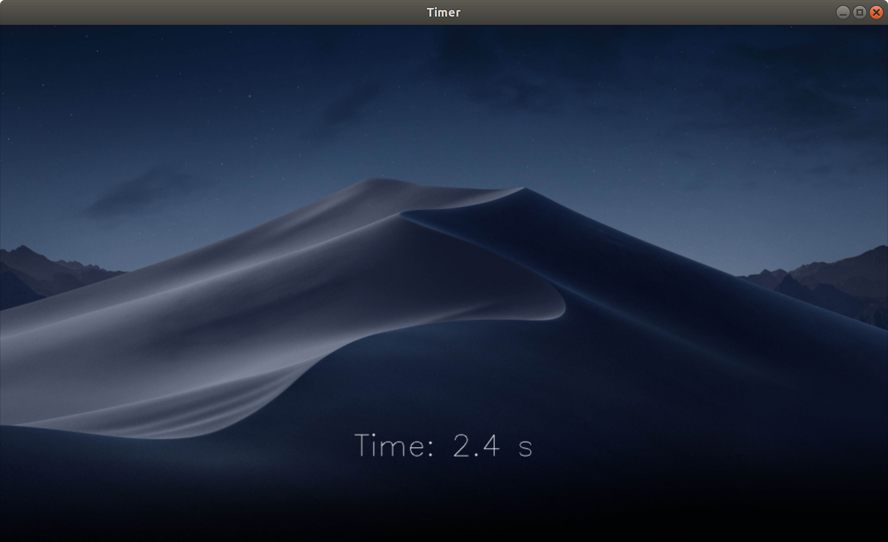

## A simple GUI timer
- Author: Zhang Niansong
- Revised: Zhang Niansong
- Date: 2018-10-06
- Version: 1.0.0
- Abstract: A simple GUI timer that utilizes openCV and multithreading.

---

### Project structure

```
timer_exercise
|- include/  (header file)
|- src/  (source files)
|- bin/  (executable and welcome image)
|- README.md
|- CMakelists.txt
```

---

### Compile and Run

```
# compile
cmake .
make

# run
cd ./bin
./Timer
```

---

### Sample OUTPUT

```
# terminal
[INFO] Welcome to the counter.
start
[INFO] Start counting.
1
2
3
pause
[INFO] Paused.
resume
[INFO] Resumed.
7
8
stop
[INFO] Stop counting.
quit
[INFO] Program existed.
```

GUI:


